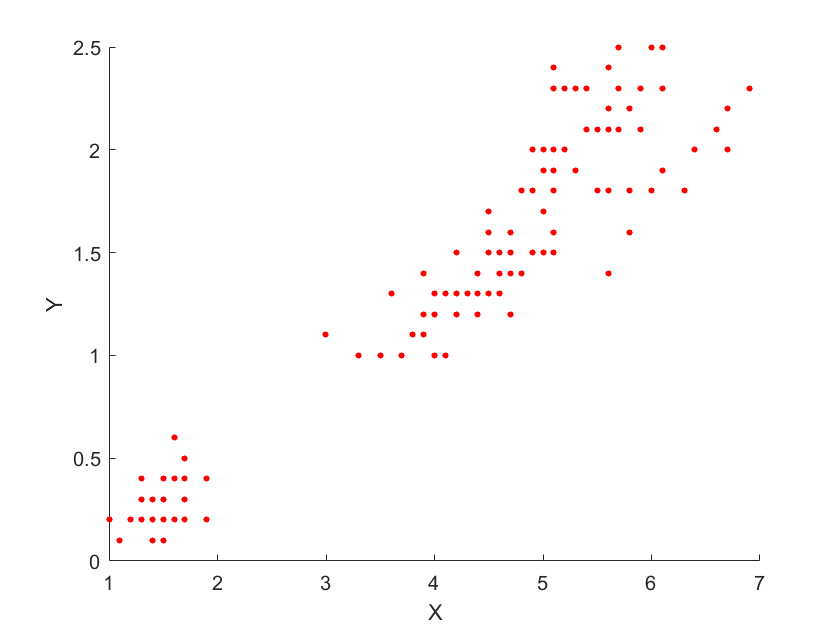
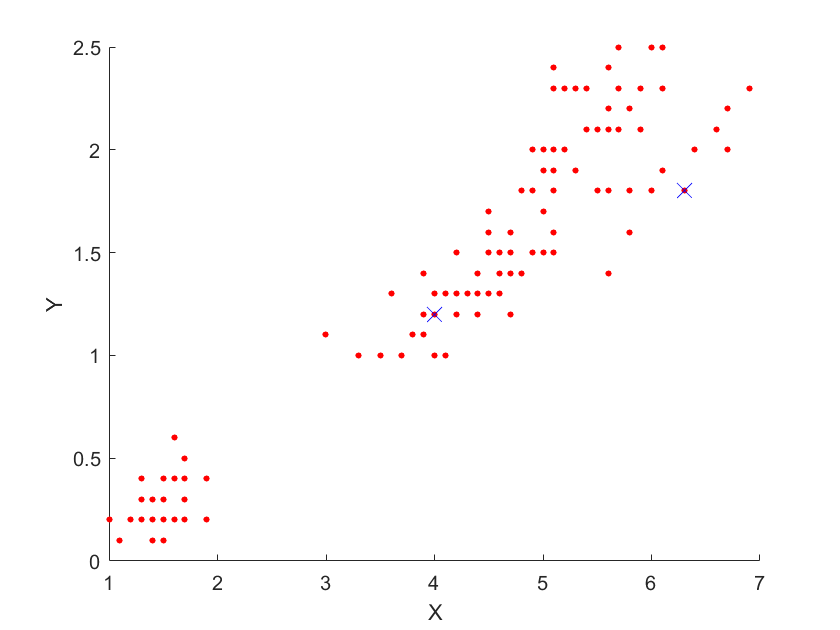

# k-means

Using the k-means algorithm to produce some pretty pictures.

| Before | After (k=2) |
| --- | --- |
|  |  |

| k=4 | k=16 |
| --- | --- |
|  |  |

## k-means algorithm

The k-means algorithm is a way for a computer to organise data into `k` clusters. The [wikipedia](https://en.wikipedia.org/wiki/K-means_clustering) page gives a good overview of the algorithm, but it's a bit dense so I'll give a quick one here.

Let's use this 2D data as an example:

Now let's try and find 2 clusters in this data. To us it is obvious, but to a computer not so much.

The first stage of the algorithm is selecting `k` points to act as the centre points of the clusters. These are usually chosen at random from the pool of data, which is what we're going to do. Here are the two random points we have chosen:

These cluster points are at positions `[6.3, 1.8]` and `[4.0, 1.2]`.
